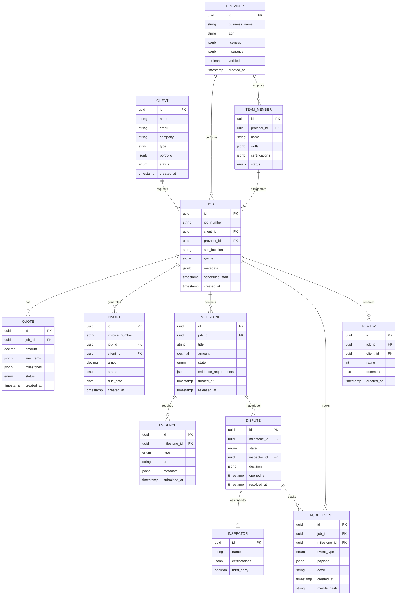
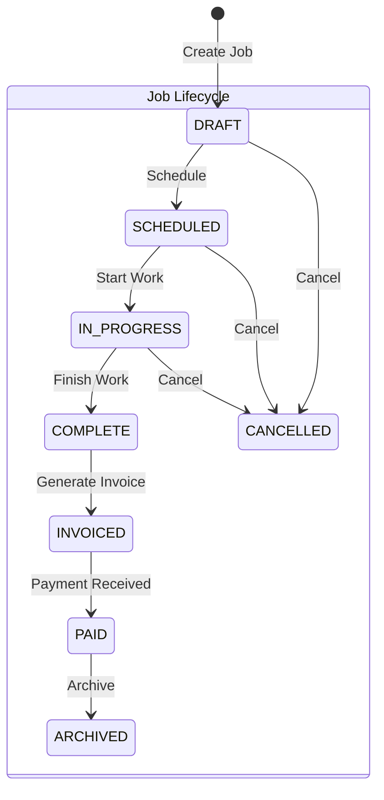
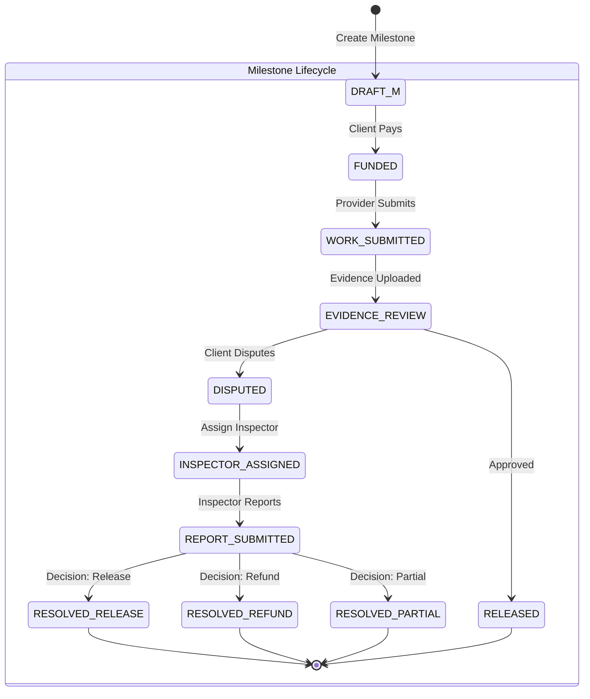
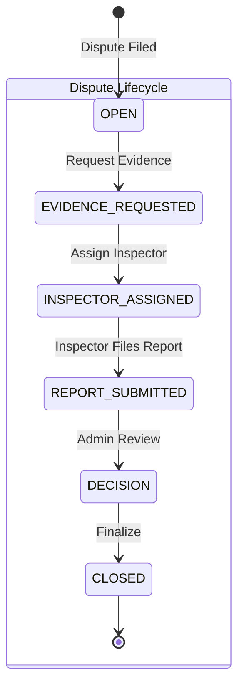
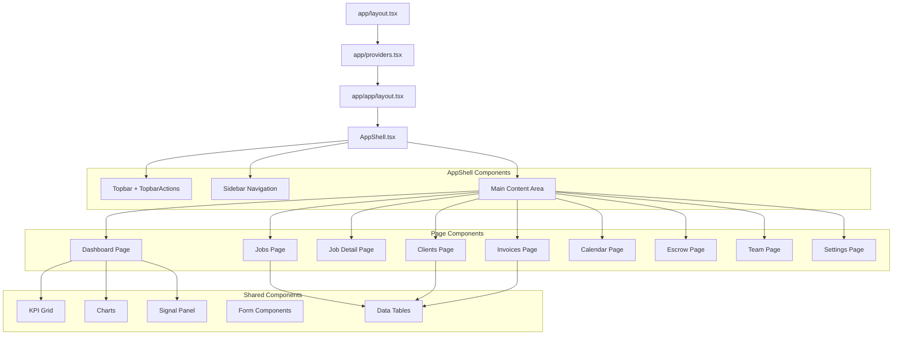
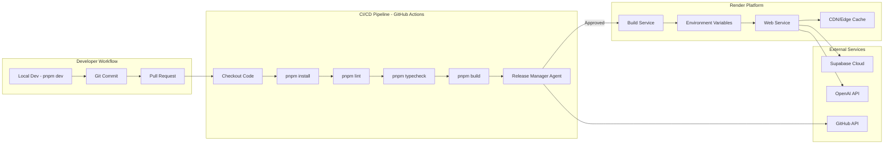
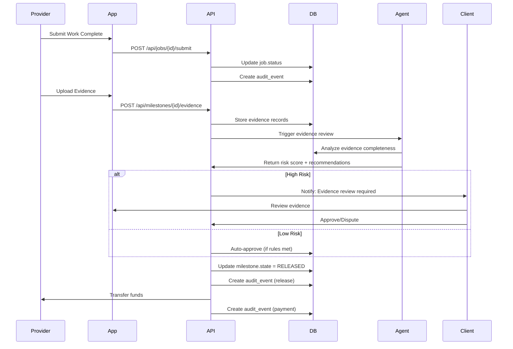
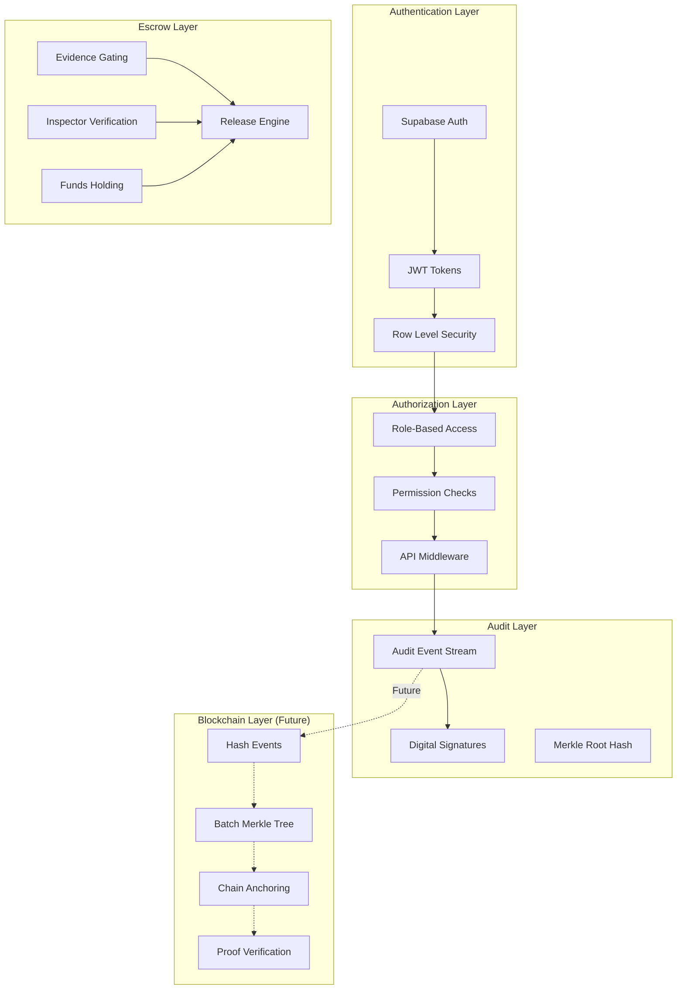

# TradeHub Platform Architecture

## System Architecture Overview

```mermaid
graph TB
    subgraph "Client Layer"
        WEB[Web Browser]
        MOBILE[Mobile Browser]
    end
    
    subgraph "Application Layer - Next.js 15 App Router"
        subgraph "Route Groups"
            ROOT[/ - Landing]
            APP[/app/* - Ops OS]
            ESCROW[/escrow/* - Buyer Portal]
            MARKET[/market/* - Marketplace]
            DISPATCH[/dispatch - Dispatch Board]
        end
        
        subgraph "API Routes"
            API_JOBS[/api/jobs]
            API_CLIENTS[/api/clients]
            API_INVOICES[/api/invoices]
            API_ESCROW[/api/escrow]
            API_AGENT[/api/agent/*]
            API_HEALTH[/api/health]
        end
    end
    
    subgraph "State Management"
        PROVIDERS[Providers - ThemeProvider]
        CONTEXT[React Context]
        SERVER_STATE[Server Components State]
    end
    
    subgraph "Component Architecture"
        SHELL[AppShell - Sidebar + Topbar]
        SHARED[Shared Components]
        FILLED[Filled Components]
        UI[UI Primitives]
    end
    
    subgraph "Backend Services - Supabase"
        AUTH[Auth Service]
        DB[(PostgreSQL Database)]
        STORAGE[File Storage]
        REALTIME[Realtime Subscriptions]
        EDGE[Edge Functions]
    end
    
    subgraph "Integrations"
        GITHUB[GitHub API - PR/CI]
        OPENAI[OpenAI Agents API]
        RENDER[Render Deploy API]
    end
    
    subgraph "Automation Layer - OpenAI Agents"
        AGENT_RELEASE[Release Manager]
        AGENT_CI[CI Triage Agent]
        AGENT_REGRESSION[Regression Guard]
        AGENT_SUPPORT[Support Triage]
        AGENT_DISPUTE[Dispute Assistant]
        AGENT_DATA[Data Entry Agent]
    end
    
    subgraph "Future: Blockchain Anchoring"
        MERKLE[Merkle Root Generator]
        CHAIN[Public Chain - Ethereum/Polygon]
        PROOF[Proof Verification API]
    end
    
    WEB --> ROOT
    WEB --> APP
    WEB --> ESCROW
    WEB --> MARKET
    MOBILE --> APP
    
    APP --> SHELL
    APP --> API_JOBS
    APP --> API_CLIENTS
    APP --> API_INVOICES
    APP --> API_ESCROW
    
    SHELL --> SHARED
    SHELL --> FILLED
    SHARED --> UI
    
    API_JOBS --> DB
    API_CLIENTS --> DB
    API_INVOICES --> DB
    API_ESCROW --> DB
    API_AGENT --> OPENAI
    
    DB --> REALTIME
    REALTIME --> WEB
    
    API_AGENT --> AGENT_RELEASE
    API_AGENT --> AGENT_CI
    API_AGENT --> AGENT_DISPUTE
    
    AGENT_RELEASE --> GITHUB
    AGENT_CI --> GITHUB
    
    DB -.Future.-> MERKLE
    MERKLE -.-> CHAIN
    CHAIN -.-> PROOF
    
    AUTH --> DB
    STORAGE --> DB
```

## Domain Model Architecture



## State Machine Flows







## Component Hierarchy



## Deployment Architecture



## Data Flow - Escrow Release



## Security & Trust Layers


