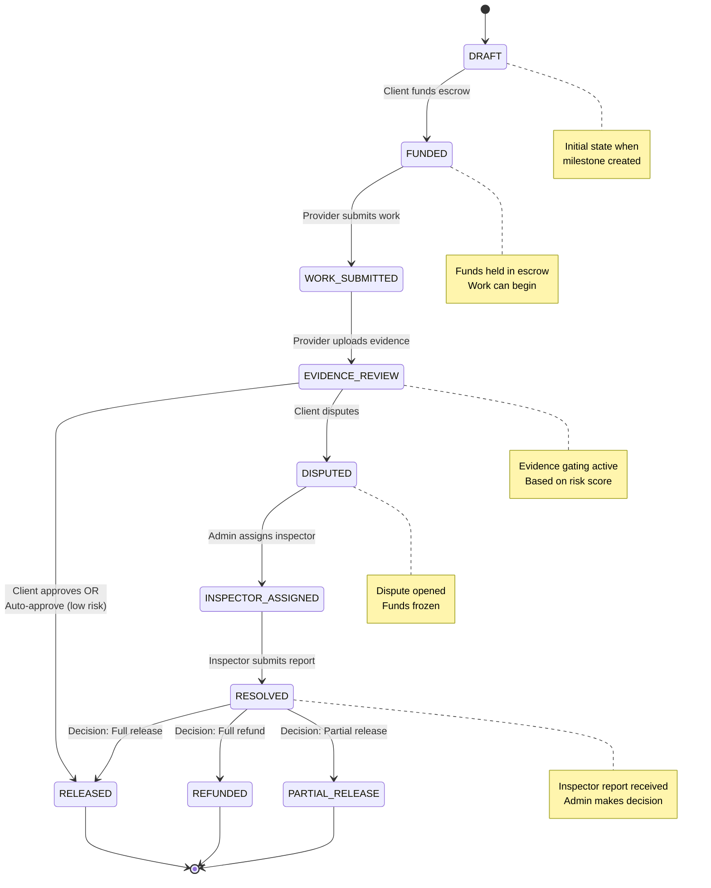
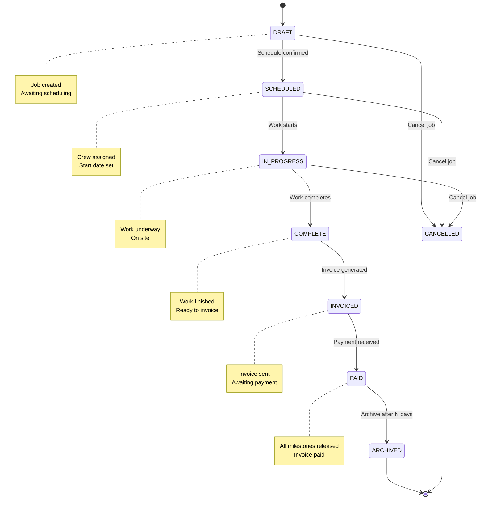
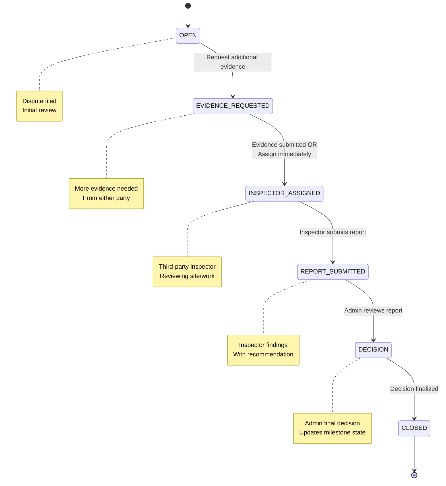
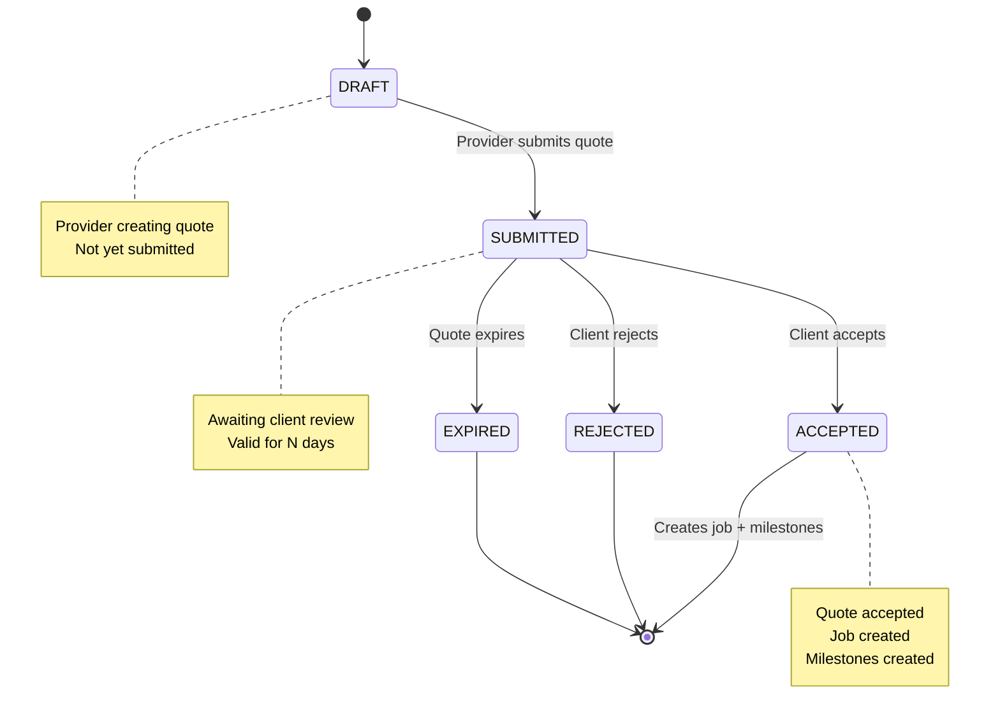
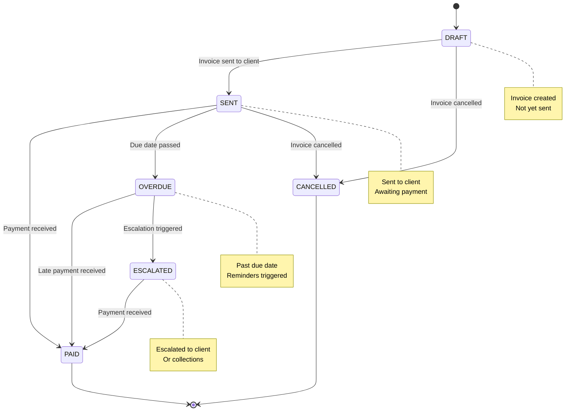
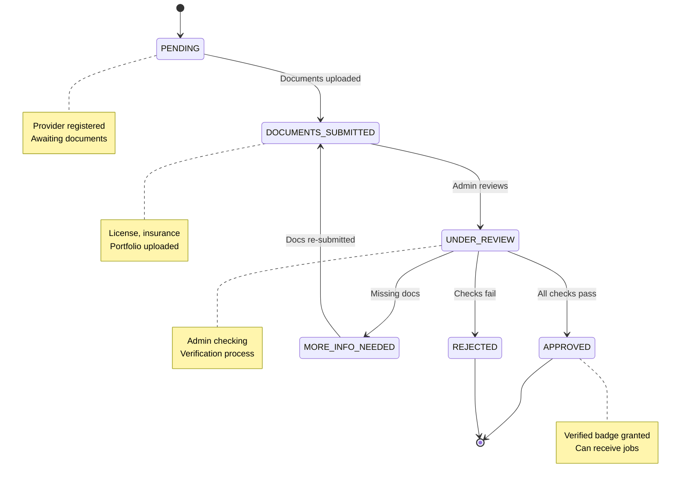
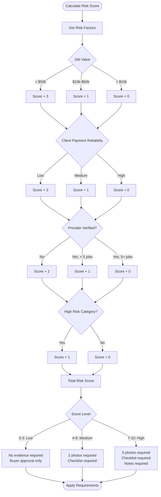
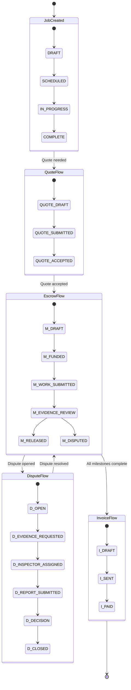
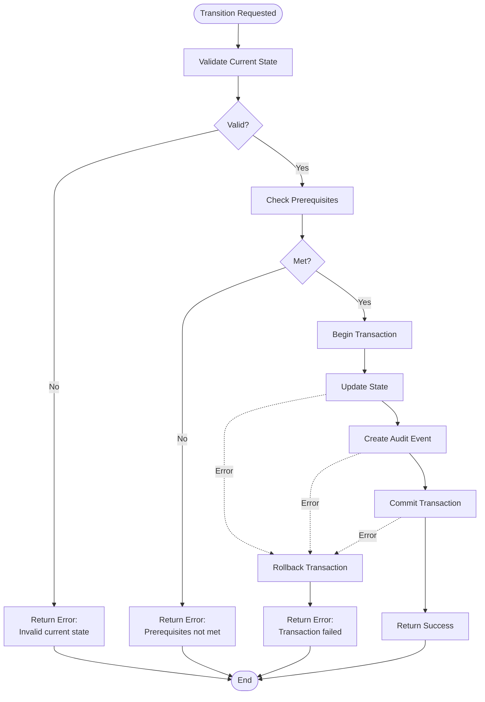

# TradeHub State Machine Diagrams

This document visualizes all state machines in the TradeHub platform using Mermaid diagrams.

---

## 1. Milestone State Machine

The milestone state machine is the core of the escrow engine. It enforces trust through evidence gating and dispute resolution.



### State Definitions

**DRAFT**
- Initial state when milestone is created
- No funds held yet
- Provider cannot start work

**FUNDED**
- Client has paid funds into escrow
- Provider can begin work
- Funds are held securely

**WORK_SUBMITTED**
- Provider has marked work as complete
- Awaiting evidence upload
- Funds still held

**EVIDENCE_REVIEW**
- Evidence uploaded and under review
- Evidence requirements based on risk score
- Can auto-approve if low risk and complete

**RELEASED**
- Funds transferred to provider
- Terminal state
- Audit event logged

**DISPUTED**
- Client has disputed the work
- Funds frozen
- Requires inspector assignment

**INSPECTOR_ASSIGNED**
- Third-party inspector assigned
- Inspector reviews evidence
- Inspector submits report

**RESOLVED**
- Inspector report submitted
- Admin reviews and makes decision
- Transitions to final state based on decision

**REFUNDED / PARTIAL_RELEASE**
- Terminal states
- Funds distributed per decision
- Audit events logged

---

## 2. Job State Machine

The job lifecycle tracks the overall progress from creation to completion and payment.



### State Definitions

**DRAFT**
- Initial state
- Quote may be pending
- No crew assigned yet

**SCHEDULED**
- Start date confirmed
- Crew assigned
- Calendar blocked

**IN_PROGRESS**
- Work has started
- Daily updates expected
- Progress tracked

**COMPLETE**
- All work finished
- Final evidence submitted
- Ready for invoicing

**INVOICED**
- Invoice generated and sent
- Awaiting payment
- May trigger reminders

**PAID**
- All payments received
- All milestones released
- Job can be archived

**ARCHIVED**
- Moved to historical records
- Read-only
- Terminal state

**CANCELLED**
- Job cancelled before completion
- Terminal state
- Reason logged

---

## 3. Dispute State Machine

The dispute resolution workflow ensures fair outcomes for both parties.



### State Definitions

**OPEN**
- Dispute has been filed
- Initial triage
- May request more evidence

**EVIDENCE_REQUESTED**
- Additional evidence needed
- From provider or client
- Deadline set

**INSPECTOR_ASSIGNED**
- Third-party inspector assigned
- Inspector reviews evidence
- May visit site

**REPORT_SUBMITTED**
- Inspector has filed report
- Includes recommendation
- Awaiting admin review

**DECISION**
- Admin reviews inspector report
- Makes final decision
- Updates milestone state accordingly

**CLOSED**
- Dispute resolved
- Terminal state
- Milestone transitions per decision

---

## 4. Quote State Machine

Tracks quotes from submission through acceptance or rejection.



---

## 5. Invoice State Machine

Tracks invoices from creation through payment.



---

## 6. Provider Verification State Machine

Tracks provider verification from application to approval.



---

## 7. Complete Escrow Flow Diagram

This shows the full escrow lifecycle with all possible paths.

```mermaid
flowchart TD
    Start([Job Created]) --> QuoteAccepted{Quote Accepted?}
    QuoteAccepted -->|Yes| CreateMilestones[Create Milestones]
    QuoteAccepted -->|No| End1([Job Cancelled])
    
    CreateMilestones --> FundEscrow[Client Funds Escrow]
    FundEscrow --> MilestoneFunded[Milestone: FUNDED]
    
    MilestoneFunded --> ProviderWorks[Provider Performs Work]
    ProviderWorks --> SubmitWork[Provider Submits Work]
    SubmitWork --> WorkSubmitted[Milestone: WORK_SUBMITTED]
    
    WorkSubmitted --> UploadEvidence[Upload Evidence]
    UploadEvidence --> EvidenceReview[Milestone: EVIDENCE_REVIEW]
    
    EvidenceReview --> CheckRisk{Risk Score}
    
    CheckRisk -->|Low Risk| AutoCheck{Evidence Complete?}
    AutoCheck -->|Yes| AutoApprove[Auto-Approve]
    AutoCheck -->|No| WaitClient[Wait for Client]
    
    CheckRisk -->|Med/High Risk| WaitClient
    
    WaitClient --> ClientReview{Client Decision}
    
    ClientReview -->|Approve| Release[Milestone: RELEASED]
    ClientReview -->|Dispute| OpenDispute[Milestone: DISPUTED]
    
    AutoApprove --> Release
    
    OpenDispute --> AssignInspector[Assign Inspector]
    AssignInspector --> InspectorAssigned[Milestone: INSPECTOR_ASSIGNED]
    
    InspectorAssigned --> InspectorReview[Inspector Reviews]
    InspectorReview --> SubmitReport[Inspector Submits Report]
    SubmitReport --> Resolved[Milestone: RESOLVED]
    
    Resolved --> AdminDecision{Admin Decision}
    
    AdminDecision -->|Release| Release
    AdminDecision -->|Refund| Refund[Milestone: REFUNDED]
    AdminDecision -->|Partial| Partial[Milestone: PARTIAL_RELEASE]
    
    Release --> TransferFunds[Transfer Funds to Provider]
    Refund --> RefundClient[Refund Client]
    Partial --> SplitFunds[Split Funds]
    
    TransferFunds --> LogAudit1[Log Audit Event]
    RefundClient --> LogAudit2[Log Audit Event]
    SplitFunds --> LogAudit3[Log Audit Event]
    
    LogAudit1 --> CheckMore{More Milestones?}
    LogAudit2 --> CheckMore
    LogAudit3 --> CheckMore
    
    CheckMore -->|Yes| NextMilestone[Next Milestone]
    CheckMore -->|No| JobComplete[Job: COMPLETE]
    
    NextMilestone --> MilestoneFunded
    
    JobComplete --> GenerateInvoice[Generate Invoice]
    GenerateInvoice --> SendInvoice[Send Invoice]
    SendInvoice --> PaymentReceived[Payment Received]
    PaymentReceived --> JobPaid[Job: PAID]
    
    JobPaid --> Archive[Job: ARCHIVED]
    Archive --> End2([End])
    End1 --> End2
```



---

## 8. Evidence Gating Logic

Decision tree for evidence requirements based on risk score.



---

## 9. Agent Decision Flow

How automation agents provide recommendations without making decisions.

```mermaid
flowchart TD
    Start([Agent Triggered]) --> LoadContext[Load Context Data]
    
    LoadContext --> CallOpenAI[Call OpenAI API]
    CallOpenAI --> ParseResponse[Parse AI Response]
    
    ParseResponse --> ExtractRecommendation[Extract Recommendation]
    ExtractRecommendation --> ExtractReasoning[Extract Reasoning]
    ExtractReasoning --> ExtractConfidence[Extract Confidence Score]
    
    ExtractConfidence --> LogAudit[Log as Audit Event]
    
    LogAudit --> CheckAgentType{Agent Type}
    
    CheckAgentType -->|PR/CI Agent| PostComment[Post to GitHub PR]
    CheckAgentType -->|Dispute Agent| DisplayUI[Display in Admin UI]
    CheckAgentType -->|Support Agent| CreateTask[Create Support Task]
    
    PostComment --> WaitHuman[Wait for Human Review]
    DisplayUI --> WaitHuman
    CreateTask --> WaitHuman
    
    WaitHuman --> HumanDecision{Human Decision}
    
    HumanDecision -->|Approve| Execute[Execute Action]
    HumanDecision -->|Reject| NoAction[No Action Taken]
    HumanDecision -->|Modify| ModifyAndExecute[Modify Then Execute]
    
    Execute --> LogExecute[Log Execution]
    NoAction --> LogReject[Log Rejection]
    ModifyAndExecute --> LogModify[Log Modification]
    
    LogExecute --> End([End])
    LogReject --> End
    LogModify --> End
    
    note right of WaitHuman
        CRITICAL: Agent never<br/>executes critical actions<br/>automatically
    end note
```

---

## 10. Complete Platform State Diagram

High-level view of all interconnected state machines.



---

## State Transition Rules

### Global Rules
1. **Cannot skip states** - Must follow defined paths
2. **Audit all transitions** - Every state change logged
3. **Validate prerequisites** - Check requirements before transition
4. **Atomic updates** - State changes are transactional
5. **Idempotent operations** - Safe to retry transitions

### Milestone-Specific Rules
- Cannot release without evidence if requirements not met
- Cannot dispute after release
- Cannot fund twice
- Inspector assignment requires dispute state
- Resolved state requires inspector report

### Job-Specific Rules
- Cannot start without schedule
- Cannot complete without all milestones resolved
- Cannot invoice without completion
- Cannot archive until paid

### Dispute-Specific Rules
- Cannot close without decision
- Cannot assign inspector twice
- Cannot re-open after closed
- Report submission requires inspector assignment

---

## Error Handling in State Transitions



---

## Audit Trail Integration

Every state transition creates an audit event:

```typescript
{
  id: "uuid",
  eventType: "MILESTONE_STATE_CHANGE",
  payload: {
    milestoneId: "uuid",
    fromState: "EVIDENCE_REVIEW",
    toState: "RELEASED",
    triggeredBy: "client:uuid" | "system" | "agent:name",
    reason: "Client approved",
    metadata: {
      evidenceComplete: true,
      riskScore: 3,
      autoApproved: false
    }
  },
  timestamp: "2026-02-01T10:23:45Z"
}
```

This ensures complete traceability and supports blockchain anchoring in the future.
